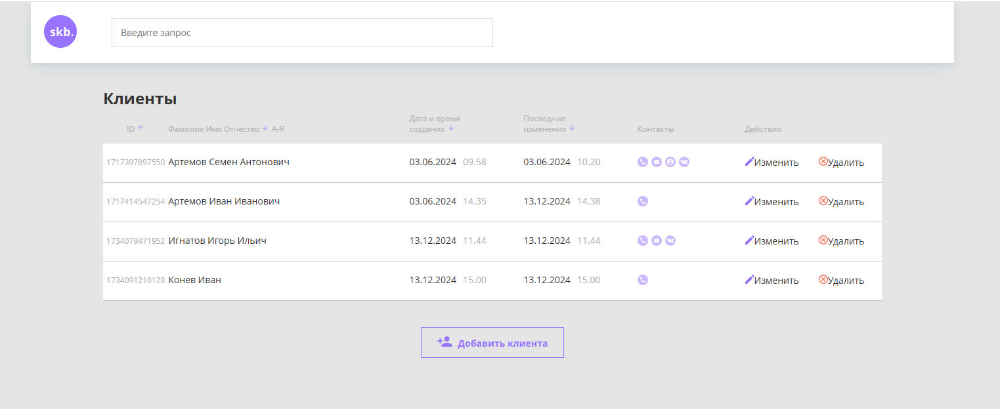

# Описание проекта


Программа представляет собой интерфейс для просмотра и управления списком клиентов. Она включает в себя функционал для:

+ Добавления, редактирования и удаления клиентов.

+  Сортировки по ID, ФИО, дате добавления и дате редактирования.

+ Поиска клиентов по имени.

+ Анимации открытия модального окна.

+ Копирования ссылки на карточку клиента.

+ Валидации формы перед отправкой на сервер.

## Запуск проекта
`1.` Запуск бэкенда
Для того чтобы запустить бэкенд, следуйте инструкции в соответствующем [README файле](backend/README.md).

`2.` Установка зависимостей
```bash
npm install
```


### Стек технологий

`1.`JavaScript — язык программирования проекта.

`2.`Валидация форм — проверка данных перед отправкой.
